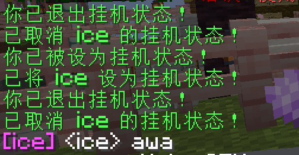

# MCAFK
> 轻量但高级的挂机的插件

> 其实玩家头顶也会显示 [挂机中]。

# 插件使用方法
`/afk` 挂机/取消挂机
> 挂机过程中不可被攻击/移动
`/afk {玩家}` 管理员开关玩家挂机状态

# 支持版本
> 1.21+（已测试） 其他版本如无法使用请安装maven修改配置编译，您可以直接使用export.bat进行编译。

# 特别说明
> 已授权 <a href="https://www.mcbbs.app">MCBBS 2nd</a> 进行转载，其他平台转载请联系作者（除社交聊天平台）
> 即便协议并没有限制，作者本人还是不建议您售卖插件，这是不道德的。
